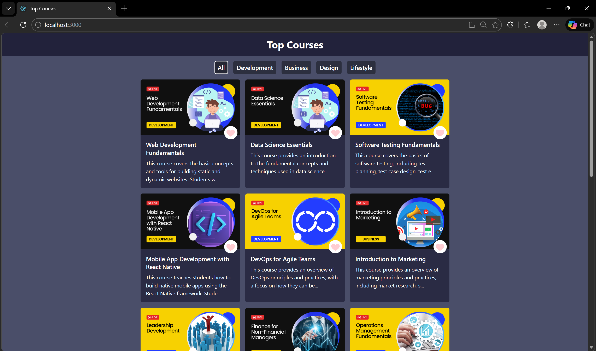
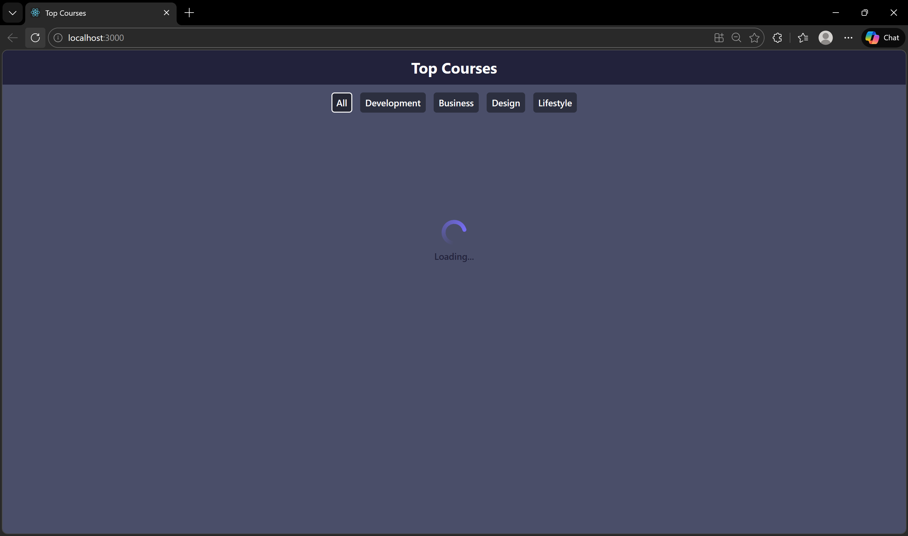
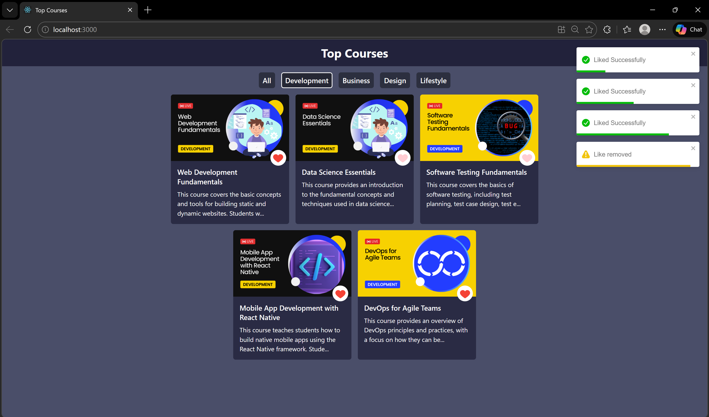
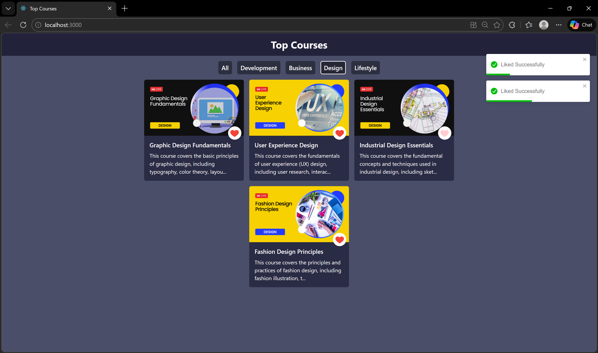

# Top Courses Project

A React-based web application that displays a list of top courses
fetched from an external API.\
The application allows users to filter courses by category and like
individual courses, providing a clean and responsive user experience.

------------------------------------------------------------------------

## Features

-   Dynamic course data fetched from an external API\
-   Category-based filtering\
-   Like and unlike course functionality\
-   Loading indicator during data fetch\
-   Responsive UI using Tailwind CSS

------------------------------------------------------------------------

## Tech Stack

-   React (Functional Components, Hooks)
-   Tailwind CSS
-   react-toastify
-   react-icons

------------------------------------------------------------------------

## Project Structure

    src/
    ├── components/
    │   ├── Card.js
    │   ├── Cards.js
    │   ├── Filter.js
    │   ├── Navbar.js
    │   ├── Spinner.js
    │   └── Spinner.css
    ├── App.js
    ├── data.js
    ├── index.js
    └── index.css

------------------------------------------------------------------------

## Installation & Setup

``` bash
npm install
npm start
```

The application runs at:

    http://localhost:3000

------------------------------------------------------------------------

## API Used

    https://codehelp-apis.vercel.app/api/get-top-courses

------------------------------------------------------------------------

## Screenshots


``` md




```

------------------------------------------------------------------------

## License

This project is developed for educational and learning purposes.
